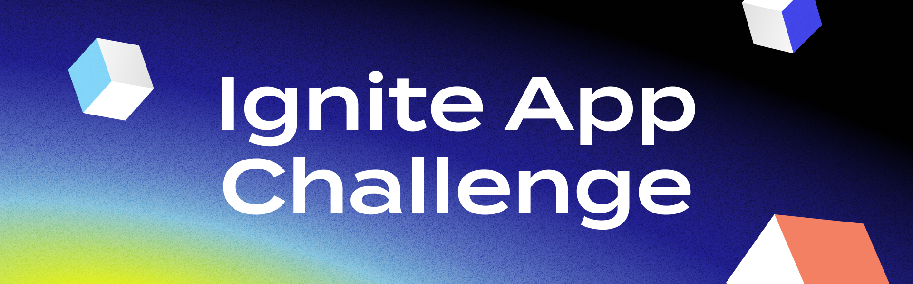

# Ignite Notify Plugin

A modular notification plugin for the Ignite CLI and Cosmos SDK ecosystem. It allows you to subscribe to blockchain events from a local node and receive real-time notifications via multiple channels (stdout, Slack, Telegram, ...).

---

## Features

- **Subscribe to Tendermint/Cosmos events** via custom queries
- **Multiple notification sinks**: stdout, Slack, Telegram (extensible)
- **YAML-based persistent configuration**
- **Automatic WebSocket reconnection**
- **Command-line management**: add, list, remove, run subscriptions
- **Modular internal architecture**: config, runner, sink, subscriber
- **Test coverage for all major components**

---

## Architecture

- **cmd/**: CLI entrypoints (`add`, `list`, `remove`, `run`, `autorun`)
- **internal/config**: YAML config management and subscription struct
- **internal/sink**: Sink interface and implementations (stdout, Slack, Telegram)
- **internal/subscriber**: WebSocket subscription logic, sink dispatch
- **internal/runner**: Orchestrates subscriptions and manages lifecycle

---

## Installation

```
git clone https://github.com/your-org/ignite-notify.git
cd ignite-notify
go build -o ignite-notify
```

---

## Usage

### Add a subscription
```
ignite add --name mysub --node ws://localhost:26657 --query "tm.event='NewBlock'" --sink slack --webhook https://hooks.slack.com/services/XXX
```
Example (Telegram):
```
ignite add --name mytelegram --node ws://localhost:26657 --query "tm.event='NewBlock'" --sink telegram --webhook "https://api.telegram.org/bot<token>/sendMessage?chat_id=<chat_id>"
"""

### List subscriptions
```
ignite ls
```

### Remove a subscription
```
ignite rm --name mysub
```

### Run all subscriptions
```
ignite run
```

---

## Configuration

Subscriptions are stored in `~/.ignite/notify.yaml` as a list of objects:
```yaml
- name: mysub
  node: ws://localhost:26657
  query: tm.event='NewBlock'
  sink: slack
  webhook: https://hooks.slack.com/services/XXX
```

- **sink**: One of `stdout`, `slack`, `telegram` (extensible)
- **webhook**: For Slack, use the webhook URL. For Telegram, use the full Bot API URL with token and chat_id.

---

## Extending

- Add new sinks by implementing the `Sink` interface in `internal/sink/sink.go`.
- Add new commands or flags in `cmd/` and register them in `app.go`.

---

## Development & Testing

### Troubleshooting

#### If you see `Unknown command path: ignite add`
- Make sure you have updated the plugin dispatcher in `app.go` to handle both `add` and `ignite add` (and same for other commands).
- Uninstall and reinstall the plugin:
  ```sh
  ignite app uninstall -g /home/nova/Documents/projects/Ignite/ignite-notify
  ignite app install -g /home/nova/Documents/projects/Ignite/ignite-notify
  ```
- If the problem persists, check that you are running the latest code and that the app is properly registered.

- All code is modular and covered by unit tests.
- Run all tests:
  ```
  go test ./...
  ```
- Test files are present in each major package (`cmd/`, `internal/config/`, `internal/sink/`, `internal/runner/`).

---

## Example: Telegram Sink

To receive notifications on Telegram, create a bot and use the following API URL as webhook:
```
https://api.telegram.org/bot<YOUR_TOKEN>/sendMessage?chat_id=<YOUR_CHAT_ID>
```

---

## Roadmap / TODO
- Add more sinks (Discord, email, ...)
- Improve error handling and reconnection strategies
- Add integration tests and CLI e2e tests
- Document advanced event queries

---

## License
MIT




## Overview
We're offering a bounty for the development of new "Ignite Apps" that extend the functionality of the Ignite CLI command palette. These apps should enhance the blockchain development process, providing developers with new tools and capabilities.

## Bounty Reward
- **Amount**: Up to 2000 USD
- **Eligibility**: The first three submitted Ignite Apps that meet all criteria

## What is an Ignite App?
An Ignite App is an extension of the Ignite CLI commands. It has its own code and logic and can be added to the existing Ignite Commands. The app should be beneficial to developers creating blockchains by:

- Extending possibilities for creating new blockchains
- Helping with testing and bug identification
- Speeding up development processes
- Providing better insights into blockchain workings
- Assisting with key management or blockchain data handling

## Bounty Criteria
To be eligible for the bounty, your Ignite App must:

1. Be fully functional and working
2. Fulfill the description provided in the chosen App suggestion
3. Include tests that confirm the expected functionality
4. The same idea has not been submitted before

## App Suggestions
Choose one of the following 10 app suggestions to implement:

https://hackmd.io/@tendermint-devx/Sk_64jc8Jx

If you want to work on your own idea, please contact and discuss with the team that it is eligible for submission.

## Submission Guidelines
1. Fork this repository
2. Implement your chosen Ignite App
3. Ensure your app meets all bounty criteria
4. Submit a pull request with your implementation
5. Include documentation on how to use your Ignite App - This would be done by creating a step-by-step guide on how to use the App.
6. Your App must have an Open-Source License

## Evaluation Process
Submissions will be reviewed on a first-come, first-served basis. The first three submissions that meet all criteria will be awarded the bounty.

## Questions and Support
If you have any questions about the bounty or need clarification, please open an issue in this repository with the label "bounty-question".

Good luck, and happy coding!

**Additional Resources**

- Ignite App Repository: https://github.com/ignite/apps
- Ignite Website: https://ignite.com
- Ignite Documentation: https://docs.ignite.com
- Ignite App Website: https://ignite.com/marketplace
- Ignite CLI GitHub repository: https://github.com/ignite/cli


<details>
<summary>Bounty Terms and Conditions</summary>

## LEGAL DISCLAIMER 

This bounty program  (“the Program”) is a discretionary initiative to encourage and reward those who are committed to helping us improve Ignite’s CLI protocol. Ignite Global, Inc. (“Ignite”, “we”, “us”), may in its sole discretion, modify these Terms at any time and may modify, restrict, suspend, terminate, or otherwise change any aspect of this Program. The Program is not a competition. No fees are payable or purchase is necessary to participate in the Program. There is no guarantee that the Participant (“you”) will earn a reward  (“Bounty Reward”) by participating in the Program. The Program is provided “as-is”.
## ELIGIBILITY

The Bounty Rewards are subject to compliance with local laws, rules, and regulations. To be eligible to participate in the Program, you must not (a) be a citizen or resident of a country in which use or participation is prohibited by law, decree, regulation, treaty, or administrative act; (b) be a citizen or resident of, or located in, a country or region that is subject to the U.S. or other sovereign country sanctions or embargoes;  (c) an individual or an individual employed by or associated with an entity identified on the U.S. Department of Commerce’s Denied Persons or Entity List, the U.S. Department of Treasury’s Specially Designated Nationals or Blocked Persons Lists, or the Department of State’s Debarred Parties List or otherwise ineligible to receive items subject to U.S. export control laws and regulations, or other economic sanction rules of any sovereign nation; (d) be under 18 years old; If you are  at least 18 years old, but considered an underage in your place of residence, you must obtain consent from your parents or legal guardians prior to getting enrolled in the Program.

## CONFIDENTIALITY OBLIGATIONS

“Confidential Information” means any information that is marked or otherwise designated as confidential at the time of disclosure or that a reasonable person would consider confidential based on the circumstances and content of the disclosure, and includes, without limitation: customer information, personally identifiable information, financial information, information, pricing information, business information, and fees. Confidential Information does not include information that: (i) is or becomes known to the receiving party from a source other than one having an obligation of confidentiality to the disclosing party; (ii) is or becomes publicly known or otherwise ceases to be confidential, except through a breach of this Agreement; or (iii) is independently developed by the receiving party.
You agree that you will (i) hold in confidence and not disclose to any third party any Confidential Information, except as approved in writing by disclosing party; (ii) protect such Confidential Information with at least the same degree of care that the Researcher uses to protect its own Confidential Information, but in no case, less than reasonable care; (iii) use the disclosing party’s Confidential Information for no purpose other than the use permitted by the disclosing party; and (iv) immediately notify disclosing party upon discovery of any loss or unauthorized disclosure of disclosing party’s Confidential Information.
ALL SUBMISSIONS ARE CONFIDENTIAL INFORMATION OF THE PROGRAM OWNER UNLESS OTHERWISE STATED IN THE BOUNTY BRIEF. This means no submissions may be publicly disclosed at any time unless Ignite has otherwise consented to the disclosure. 

## INTELLECTUAL PROPERTY, GRANTS, AND OWNERSHIP

### Intellectual Property Rights and Ownership.

We retain all intellectual property rights in our products including, without limitation, all our source code and associated related binaries. Nothing herein shall grant you any right in any part of our products, or any improvement or derivative in any deliverable you provide us. You agree that to the extent required to abide by these Terms, you will waive any and all rights that may otherwise accrue to you in such deliverable and agree that we will not be obliged to license back any derivative or improvements of the delivered work to you.

### Grants to Ignite

By submitting a work deliverable to us, you represent and warrant that your submission is an original work of authorship and does not violate any applicable law or any third party intellectual property rights. Furthermore, you grant us a royalty-free, fully paid-up, perpetual, non-revocable, exclusive, worldwide, transferable, and sub-licensable license in respect of such work deliverable and any feedback thereto. We will not have an obligation to utilize any item you provide us. You waive any compensation related to the incorporation of any materials in a deliverable or any feedback provided to us into our products and services.

## PRIVACY

To receive a Bounty Reward, you must provide us with your personal information to conduct a Know Your Customer (“KYC”) process to ensure certain eligibility requirements are met.  KYCr information includes but is not limited to: W9 or W8-BEN, your name, email address, ID information, and your crypto wallet address.  Ignite is committed to protecting and respecting your privacy. Any access and use of your personal information will be subject to applicable law and our privacy policy available at [ignite.com/privacy](http://ignite.com/privacy).

## GOVERNING LAW AND JURISDICTION

This Program, these Terms, and any dispute arising under or related thereto (whether for breach of contract, tortious conduct, or otherwise) will be governed, construed, and interpreted under the laws of Switzerland, without reference or giving effect to its conflicts of law principles or rules that would cause the application of any other laws. Any legal actions, suits, or proceedings related to this Program (whether for breach of contract, tortious conduct, or otherwise) will be brought exclusively in the courts of the Canton of Zug and each Participant irrevocably accepts, submits, and consents to the exclusive jurisdiction and venue of these courts with respect to any legal actions, suits, or proceedings arising out of or related to this Program. You waive any and all objections to jurisdiction and venue in these courts and hereby submit to the jurisdiction of the courts of the Canton of Zug, Switzerland.
Except where prohibited, as a condition of participating in this Program, each Participant agrees that between the parties, any and all disputes, claims, and causes of action arising out of or connected with this Program, or the Bounty Reward must be resolved individually, without resort to any form of class action.

## INDEMNITY AND LIMITATION OF LIABILITY

Participant will be liable for and indemnify Ignite, its subcontractors, and their respective directors, officers, and representatives (“Ignite Indemnitees”) against any losses which Ignite Indemnitees may incur that arise from Participant’s breach of these Terms, including losses arising from Participants’ gross negligence, willful misconduct and breach of law.
In no event will Ignite be liable to you for any loss of use, revenue or profit or loss of data or for any consequential, incidental, indirect, exemplary, special, aggravated, or punitive damages whether arising out of breach of contract, tort (including negligence) or otherwise, regardless of whether such damage was foreseeable and whether or not Ignite had been advised of the possibility of such damages.
Notwithstanding anything else set out under these Terms, our aggregate liability to you under these Terms shall not exceed the lesser of the total amount of a Bounty Reward to which you may be entitled or 500 USD. 
We may terminate your engagement with us and any entitlement to any Bounty Reward if you violate any part of these Terms. Ignite reserves the right to restrict or void participation from any identifiable source if any suspicious participation is detected or any violation of these Terms is suspected or detected. Ignite reserves the right, in its sole discretion, to void the participation of any Participant who Ignite believes has attempted to tamper with or impair the administration, security, fairness, or proper execution of the Program. If Ignite determines at any time, in its sole discretion, that a Participant is engaging in behavior that Ignite deems obnoxious, deceptive, inappropriate, threatening, illegal or that is intended to annoy, abuse, or harass any other person, Ignite reserves the right to disqualify that Participant.

### General Terms

These Terms constitute the entire and exclusive understanding and agreement between Ignite and you regarding the Program, and these Terms supersede and replace any and all prior oral or written understandings or agreements between Ignite and you regarding the Program. If any provision of these Terms is held invalid or unenforceable by a court of competent jurisdiction, that provision will be enforced to the maximum extent permissible and the other provisions of these Terms will remain in full force and effect. You may not assign or transfer these Terms, by operation of law or otherwise, without our prior written consent. Any attempt by you to assign or transfer these Terms, without such consent, will be null. We may freely assign or transfer these Terms without restriction. Subject to the foregoing, these Terms will bind and inure to the benefit of the parties, their successors and permitted assigns.
You agree and consent to receive electronically all communications, agreements, documents, notices,and disclosures (collectively, “Communications”) that we provide in connection with your participation in the Program.

## Contact Information

If you have any questions about these Terms, please contact us at legal@tendermint.com.
</details>
